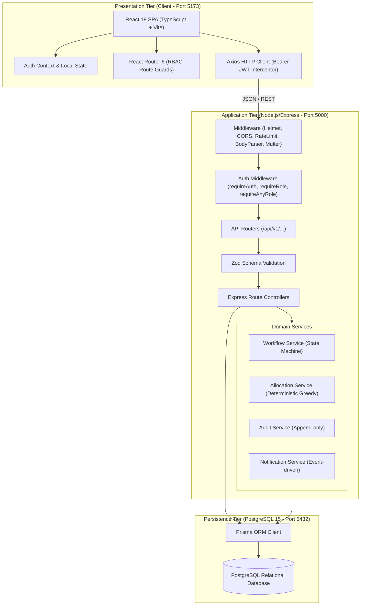

# System Architecture Document

## Department Activity & Workflow Management System

This document outlines the architectural patterns, layered organization, data flow, and design principles implemented across the application.

---

## 1. Architectural Style: Layered Client-Server Architecture

The system is organized into a clean, decoupled **3-Tier Architecture**:
1. **Presentation Layer (Frontend SPA):** React 18 with TypeScript, Vite, Tailwind CSS, and React Router 6.
2. **Application / Business Logic Layer (Backend API):** Node.js and Express with TypeScript, Zod validation, JWT authentication, and specialized services (`WorkflowService`, `AllocationService`, `AuditService`, `NotificationService`).
3. **Persistence Layer (Database):** PostgreSQL 15 managed with Prisma ORM.



---

## 2. Directory Structure

```
├── client/                     # Frontend Application
│   ├── public/                 # Static Assets
│   ├── src/
│   │   ├── api/                # Axios instance & interceptors
│   │   ├── components/         # Reusable UI (StatusBadge, WorkflowTimeline, Modal, StatCard)
│   │   ├── context/            # AuthContext (JWT, user state, RBAC helpers)
│   │   ├── layouts/            # DashboardLayout, Sidebar, Navbar
│   │   ├── pages/              # Role-specific and module pages
│   │   │   ├── auth/           # Login & Quick Demo switchers
│   │   │   ├── dashboards/     # Student, Faculty, HOD, Admin dashboards
│   │   │   ├── requests/       # Requests list, details, creation modal
│   │   │   ├── activities/     # Activities list, details, creation modal
│   │   │   ├── approvals/      # Pending approvals inbox for HOD/Admin
│   │   │   ├── projects/       # Proposals, Preferences, Allocation views
│   │   │   ├── faculty/        # Mentored students & faculty directory
│   │   │   ├── students/       # Student directory & academic info
│   │   │   ├── announcements/  # Announcements feed & creator
│   │   │   ├── reports/        # Departmental analytics & charts
│   │   │   ├── audit/          # System audit log explorer
│   │   │   ├── admin/          # Users management & academic structure
│   │   │   └── profile/        # User profile & credentials
│   │   ├── types/              # TypeScript interface definitions
│   │   ├── App.tsx             # Route definitions & protected guards
│   │   ├── index.css           # Tailwind CSS directives
│   │   └── main.tsx            # Vite root entrypoint
│   ├── package.json
│   ├── tsconfig.json
│   ├── tailwind.config.js
│   └── vite.config.ts
│
├── server/                     # Backend Application
│   ├── prisma/
│   │   ├── schema.prisma       # 20 relational models and enums
│   │   └── seed.ts             # Comprehensive demo dataset seeder
│   ├── src/
│   │   ├── __tests__/          # Vitest integration test suite (20 tests)
│   │   ├── config/             # Environment, Prisma instance, Swagger specs
│   │   ├── controllers/        # Request handling logic for all 16 modules
│   │   ├── middleware/         # Auth, RBAC, Validation, Error, Upload, RateLimit
│   │   ├── routes/             # Express modular routes
│   │   ├── services/           # Workflow, Allocation, Audit, Notification services
│   │   ├── utils/              # JWT, bcrypt, params, API response helpers
│   │   ├── validators/         # Zod schemas for all inbound DTOs
│   │   ├── app.ts              # Express application configuration
│   │   └── server.ts           # HTTP server startup
│   ├── uploads/                # File storage for attachments
│   ├── package.json
│   └── tsconfig.json
│
├── docs/                       # Comprehensive Documentation
│   ├── architecture.md         # System architecture and layer details
│   ├── viva-notes.md           # Defense & Viva examination Q&A
│   ├── workflows.md            # Workflow engine state machine specs
│   ├── database.md             # Schema, models, and ER relationships
│   └── api.md                  # REST endpoints specification
│
├── docker-compose.yml          # Containerized multi-service definition
└── README.md                   # Project overview, setup, and demo guide
```

---

## 3. Core Design Principles

1. **Single Source of Truth:** The database schema is defined in `prisma/schema.prisma` and drives both database migrations and generated TypeScript types.
2. **Separation of Concerns:**
   - **Controllers** handle HTTP parameters, parse responses, and call services.
   - **Services** encapsulate pure domain logic (allocation matching, status transitions, notifications).
   - **Middleware** enforces cross-cutting concerns (authentication, role checks, validation, logging).
3. **Stateless Backend:** No server sessions. JWT tokens encapsulate identity, allowing trivial horizontal scaling.
4. **Idempotence & Transactional Safety:** Critical multi-table operations (e.g., approving a request, running auto-allocation) execute within `prisma.$transaction()` blocks to prevent partial mutations.
