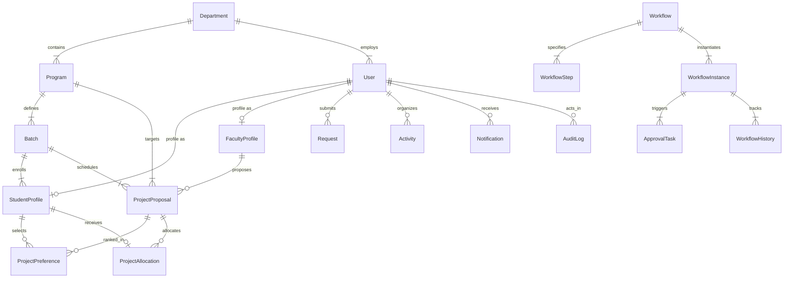

# Database Architecture & Entity-Relationship Model

## Department Activity & Workflow Management System

This document outlines the normalized relational database schema implemented in PostgreSQL using Prisma ORM.

---

## 1. Entity-Relationship Overview

---

## 2. Relational Schema Data Dictionary

### Core Authentication & Organization
| Table | Primary Key | Description | Key Foreign Keys |
| :--- | :--- | :--- | :--- |
| `User` | `id` (UUID) | System actors with credentials and roles | `departmentId` $\to$ `Department.id` |
| `Department` | `id` (UUID) | Academic department (e.g. CSE) | None |
| `Program` | `id` (UUID) | Academic program (UG / PG) | `departmentId` $\to$ `Department.id` |
| `Batch` | `id` (UUID) | Graduation cohort (e.g. 2023-2027) | `programId` $\to$ `Program.id` |

### Academic Profiles
| Table | Primary Key | Description | Key Foreign Keys |
| :--- | :--- | :--- | :--- |
| `StudentProfile` | `id` (UUID) | Student academic records (Roll, CGPA) | `userId` $\to$ `User.id`, `batchId` $\to$ `Batch.id`, `programId` $\to$ `Program.id` |
| `FacultyProfile` | `id` (UUID) | Faculty designations and research areas | `userId` $\to$ `User.id`, `departmentId` $\to$ `Department.id` |

### Requests & Activities
| Table | Primary Key | Description | Key Foreign Keys |
| :--- | :--- | :--- | :--- |
| `Request` | `id` (UUID) | Student/Faculty leave, OD, or resource requests | `requesterId` $\to$ `User.id`, `workflowInstanceId` $\to$ `WorkflowInstance.id` |
| `Activity` | `id` (UUID) | Seminars, workshops, and guest lectures | `organizerId` $\to$ `User.id`, `departmentId` $\to$ `Department.id`, `workflowInstanceId` $\to$ `WorkflowInstance.id` |
| `Document` | `id` (UUID) | File attachment records | `uploaderId` $\to$ `User.id`, `requestId`, `activityId` |

### Workflow Engine Tables
| Table | Primary Key | Description | Key Foreign Keys |
| :--- | :--- | :--- | :--- |
| `Workflow` | `id` (UUID) | Master workflow archetype definitions | None |
| `WorkflowStep` | `id` (UUID) | Sequential steps in a workflow | `workflowId` $\to$ `Workflow.id` |
| `WorkflowInstance` | `id` (UUID) | Active execution instances | `workflowId` $\to$ `Workflow.id` |
| `ApprovalTask` | `id` (UUID) | Actionable tasks for reviewers | `instanceId` $\to$ `WorkflowInstance.id`, `assignedToUserId` $\to$ `User.id` |
| `WorkflowHistory` | `id` (UUID) | Append-only transition audit records | `instanceId` $\to$ `WorkflowInstance.id`, `actorId` $\to$ `User.id` |

### Project Preference & Allocation Tables
| Table | Primary Key | Description | Constraints |
| :--- | :--- | :--- | :--- |
| `ProjectProposal` | `id` (UUID) | Faculty capstone/mini project topics | `facultyId` $\to$ `FacultyProfile.id`, `programId`, `batchId` |
| `ProjectPreference` | `id` (UUID) | Student ranked choices ($1 \dots N$) | `UNIQUE(studentId, projectId)`, `UNIQUE(studentId, rank)` |
| `ProjectAllocation` | `id` (UUID) | Finalized project assignments | `UNIQUE(studentId)`, `projectId` $\to$ `ProjectProposal.id` |

### Governance & Notifications
| Table | Primary Key | Description | Key Foreign Keys |
| :--- | :--- | :--- | :--- |
| `Notification` | `id` (UUID) | In-app alerts with read status | `userId` $\to$ `User.id` |
| `Announcement` | `id` (UUID) | Broadcast notices with target audience | `authorId` $\to$ `User.id`, `departmentId` $\to$ `Department.id` |
| `AuditLog` | `id` (UUID) | Immutable audit trails for all operations | `userId` $\to$ `User.id` |
