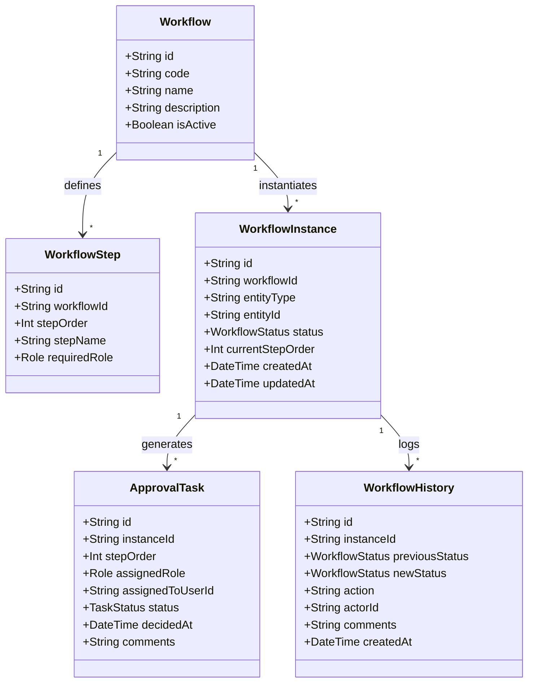
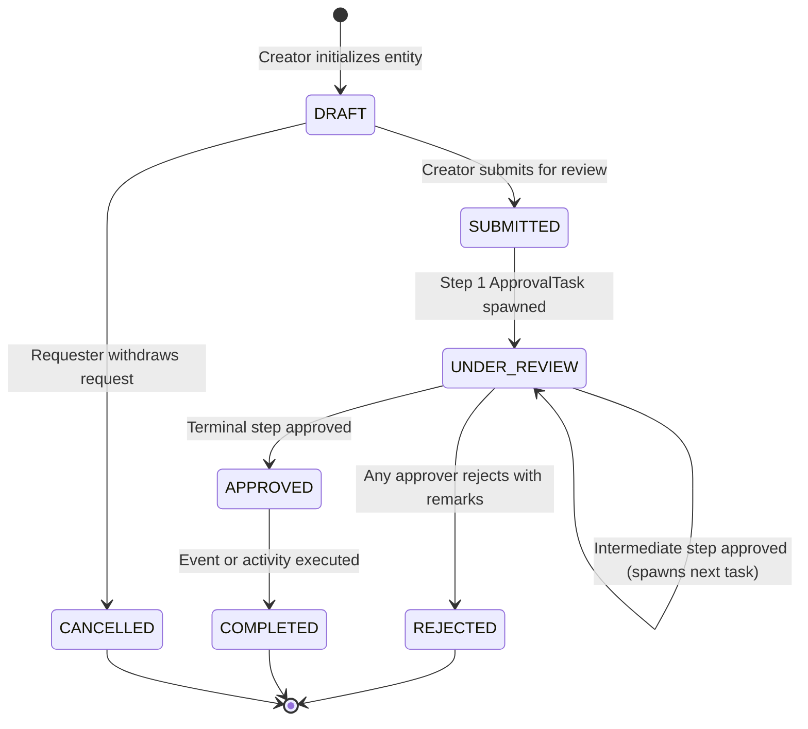
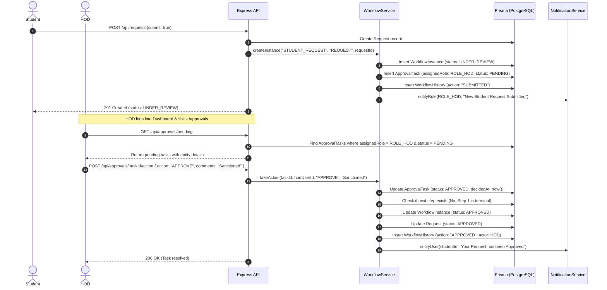

# Reusable Workflow Engine Specification

## Department Activity & Workflow Management System

This document specifies the design, lifecycle states, transitions, and extensibility of the generic Workflow Engine implemented in `server/src/services/workflowService.ts`.

---

## 1. Motivation & Objectives

In institutional management systems, approval workflows change frequently:
- New types of requests are introduced (e.g., Internship NOC, Equipment Booking).
- Approval chains evolve (e.g., adding a Faculty Advisor review prior to HOD sanction).
- Different entities require approvals (Student Requests, Faculty Activities, Project Proposals).

Rather than embedding bespoke approval columns in every entity table, we engineered a **polymorphic, step-driven workflow state machine**.

---

## 2. Core Entities & Data Model



---

## 3. Workflow State Lifecycle



### Supported Statuses:
- **`DRAFT`**: Entity created, editable by requester, not visible in approver queues.
- **`SUBMITTED`**: Initial submission, triggering workflow instance creation.
- **`UNDER_REVIEW`**: Currently pending decision on an active `ApprovalTask`.
- **`APPROVED`**: All defined workflow steps approved.
- **`REJECTED`**: Rejected by an approver with required comments.
- **`CANCELLED`**: Cancelled by requester prior to final decision.
- **`COMPLETED`**: Terminal status for activities once executed.

---

## 4. Execution Sequence: Student Request Approval



---

## 5. How to Add a New Workflow in 3 Steps

1. **Register the Workflow:**
   ```typescript
   await prisma.workflow.create({
     data: {
       code: 'INTERNSHIP_NOC',
       name: 'Internship NOC Clearance',
       description: 'Two-stage clearance for external student internships',
       steps: {
         create: [
           { stepOrder: 1, stepName: 'Faculty Mentor Endorsement', requiredRole: 'ROLE_FACULTY' },
           { stepOrder: 2, stepName: 'HOD Clearance & Seal', requiredRole: 'ROLE_HOD' },
         ],
       },
     },
   });
   ```
2. **Bind Entity in Controller:**
   Call `workflowService.createInstance('INTERNSHIP_NOC', 'NOC_REQUEST', nocRecord.id)` upon submission.
3. **No Frontend Alteration Required:**
   The `WorkflowTimeline` component dynamically renders each step and history entry without bespoke component code.
